# ADR-020 — Audio Backend Architecture

**Status:** Implemented
**Target:** 2.0.4-beta.9
**Implementation:** Complete (beta.9 development, routing fix applied)
**Replaces:** ADR-019 (Beta.8 mlx-vlm-only implementation)

---

## Context

### History: Beta.8 Audio Support (ADR-019)

mlx-knife 2.0.4-beta.8 implemented audio input via mlx-vlm (Gemma-3n multimodal):
- ✅ Audio transcription via VisionRunner
- ✅ Hardcoded `AUDIO_MODEL_TYPES` detection
- ✅ CLI `--audio file.wav` parameter
- ⚠️ Limited to ~30 second audio (Gemma-3n architecture constraint)
- ⚠️ Single backend (mlx-vlm only)

**ADR-019 Status:** Implemented in Beta.8, worked well for initial audio support.

### Beta.9 Evolution: Why Change?

**Three Key Developments:**

1. **mlx-audio GPL-Fixed (PR #379)**
   - Previously blocked due to GPL-licensed ffmpeg dependency
   - Now license-clean, viable for mlx-knife integration
   - Dedicated STT backend (Whisper, Voxtral support)

2. **Blaizzy Guidance (mlx-vlm #675)**
   - Maintainer position: "Voxtral belongs in mlx-audio, not mlx-vlm"
   - mlx-vlm = Vision-focused (multimodal with images)
   - mlx-audio = Audio-focused (STT, speech-to-text)

3. **User Need: Better STT Quality**
   - Whisper models: No duration limit (>10 min audio)
   - Better accuracy: Dedicated STT vs 4-bit multimodal
   - Segment timestamps: Word-level alignment for transcription

### Problem Statement

**Challenge:** Support BOTH use cases without breaking Beta.8 workflows

| Use Case | Model Example | Optimal Backend | Beta.8 Support |
|----------|---------------|-----------------|----------------|
| **STT** (Audio → Text) | Whisper, Voxtral | mlx-audio | ❌ No |
| **Multimodal** (Vision+Audio → Text) | Gemma-3n, Qwen3-Omni | mlx-vlm | ✅ Yes |

**Options Considered:**

- **Option A (Clean Break):** Replace mlx-vlm audio with mlx-audio (breaks Gemma-3n)
- **Option B (Dual Support):** Keep both, manual model selection (complex UX)
- **Option C (Auto-Routing):** Detect model type, route to optimal backend

---

## Decision: Auto-Routing Architecture (Option C)

**Strategy:** Model-agnostic detection + automatic backend selection

### High-Level Design

```mermaid
graph TD
    A[Audio Request<br/>mlxk run MODEL --audio file.wav] --> B[Model Detection<br/>config inspection]

    B --> C{Model Type?}

    C -->|Voxtral, Whisper,<br/>VibeVoice| D[STT Models]
    C -->|Gemma-3n,<br/>Qwen3-Omni| E[Multimodal Models]

    D --> F[Backend.MLX_AUDIO<br/>→ AudioRunner]
    E --> G[Backend.MLX_VLM<br/>→ VisionRunner]

    F --> H[STT Features:<br/>✓ Whisper API<br/>✓ Voxtral STT<br/>✓ Segment timestamps<br/>✓ No duration limit<br/>✓ Language hints]

    G --> I[Multimodal Features:<br/>✓ Vision+Audio context<br/>✓ Gemma-3n support<br/>⚠ ~30s audio limit<br/>✓ Backward compatible]

    style A fill:#e1f5ff
    style B fill:#fff4e1
    style F fill:#d4f4dd
    style G fill:#ffd4e5
    style H fill:#d4f4dd
    style I fill:#ffd4e5
```


<details>
<summary>View Mermaid source (click to expand)</summary>



</details>

### Core Principles

1. **Backward Compatible:** Gemma-3n workflows (Beta.8) continue working
2. **Transparent:** Users don't specify backend, auto-detected
3. **Model-Agnostic:** Config-based detection (no hardcoded model names)
4. **Best Backend:** Each model routed to optimal implementation
5. **Future-Proof:** New audio models automatically classified

### Benefits

| Benefit | Description |
|---------|-------------|
| **No Breaking Changes** | Beta.8 Gemma-3n workflows unchanged |
| **Better STT Accuracy** | Whisper/Voxtral dedicated models vs 4-bit multimodal |
| **No Duration Limits** | Whisper handles >10 minute audio |
| **Segment Timestamps** | Word-level alignment for transcription tools |
| **Clean Architecture** | Each backend optimized for its use case |
| **Future Apple Models** | Auto-routing works for new multimodal audio models |

---

## User Experience (Backward Compatible)

### CLI Interface

**Audio transcription (works for both STT and multimodal):**
```bash
# Simple transcription (auto-detects backend)
mlxk run whisper-large-v3-turbo --audio lecture.wav

# With explicit prompt (same interface for Whisper and Gemma-3n)
mlxk run gemma-3n-E2B-it-4bit --audio voice.wav --prompt "Transcribe this audio"

# Language hint (NEW for Beta.9, Whisper-specific)
mlxk run whisper-large-v3-turbo --audio recording.wav --language de
```

**Backward compatible (Beta.8 command unchanged):**
```bash
# This continues to work in Beta.9 (auto-routed to VisionRunner)
mlxk run gemma-3n-E2B-it-4bit --audio voice.wav
```

### Capability Detection

**list command (shows audio capability):**
```
$ mlxk list
NAME                      TYPE                 HEALTH   SIZE
whisper-large-v3-turbo   chat+audio           healthy  1.5GB  ← NEW (mlx-audio STT)
voxtral-mini-4bit        chat+audio           healthy  2.5GB  ← NEW (mlx-audio STT)
gemma-3n-E2B-it-4bit     chat+vision+audio    healthy  2.1GB  ← UNCHANGED (mlx-vlm multimodal)
pixtral-12b-4bit         chat+vision          healthy  6.8GB
```

**show command (details):**
```
$ mlxk show whisper-large-v3-turbo
Model: whisper-large-v3-turbo
Capabilities: text-generation, chat, audio
Type: chat
Health: healthy
Backend: mlx-audio (STT)          ← NEW info
```

### Scope

| Command | Audio Support | Notes |
|---------|---------------|-------|
| `list` | ✅ Shows `+audio` | Backend transparent |
| `show` | ✅ Details + backend info | NEW: Shows MLX_AUDIO vs MLX_VLM |
| `run` | ✅ `--audio file.wav` | NEW: `--language` for Whisper |
| `health` | ✅ Checks audio models | Both backends supported |
| `serve` | ✅ `/v1/chat/completions` | OpenAI-compatible audio input |

### Out of Scope (Unchanged from Beta.8)

- TTS/Audio output (separate feature)
- stdin audio (`--audio -`) - future
- Real-time streaming - future
- Speaker diarization output formatting - future (VibeVoice-ASR can provide, needs format design)

---

## Architecture Design

### Backend Detection Logic

**Priority-based config inspection (replaces hardcoded `AUDIO_MODEL_TYPES`):**

```python
def detect_audio_backend(probe: Path, config: Optional[Dict]) -> Optional[Backend]:
    """Model-agnostic audio backend detection (MLX_AUDIO vs MLX_VLM)."""
    if not config:
        return None

    model_type = config.get("model_type", "").lower()

    # Priority 1: Voxtral = Always mlx-audio STT (even with audio_config)
    # Reason: blaizzy guidance, STT-focused despite multimodal architecture
    if model_type == "voxtral":
        return Backend.MLX_AUDIO

    # Priority 2: audio_config + populated vision_config = mlx-vlm multimodal
    # Gemma-3n, Qwen3-Omni (Vision + Audio → Text)
    if "audio_config" in config and config.get("vision_config"):
        return Backend.MLX_VLM

    # Priority 3: Whisper model_type = mlx-audio STT
    if "whisper" in model_type:
        return Backend.MLX_AUDIO

    # Priority 4: WhisperFeatureExtractor = mlx-audio STT
    processor_path = probe / "preprocessor_config.json"
    if processor_path.exists():
        try:
            proc_data = json.load(open(processor_path))
            if "whisper" in proc_data.get("feature_extractor_type", "").lower():
                return Backend.MLX_AUDIO
        except:
            pass

    # Priority 5: Name heuristics = mlx-audio STT
    name = probe.name.lower()
    if any(kw in name for kw in ["whisper", "voxtral", "vibevoice"]):
        return Backend.MLX_AUDIO

    # Priority 6: audio_config alone = mlx-vlm (legacy/unknown multimodal)
    if "audio_config" in config:
        return Backend.MLX_VLM

    return None  # Not an audio model
```

**Key Detection Signals:**

| Model Type | Signal 1 | Signal 2 | Signal 3 | Backend |
|------------|----------|----------|----------|---------|
| Voxtral | `model_type: voxtral` | audio_config | WhisperFeatureExtractor | MLX_AUDIO |
| Whisper-* | `model_type: whisper*` | - | WhisperFeatureExtractor | MLX_AUDIO |
| VibeVoice-ASR | Name heuristic | - | WhisperFeatureExtractor | MLX_AUDIO |
| Gemma-3n | audio_config | vision_config (populated) | - | MLX_VLM |

**Note on Voxtral:** Config has `audio_config` but empty `vision_config: {}`. Priority 1 ensures it routes to mlx-audio (not mlx-vlm) per blaizzy's guidance. Works for both Original Mistral and mlx-knife converted variants.

#### Qwen3-Omni Model Family: Special Considerations

**Model Config Reality (mlx-community/Qwen3-Omni-30B-A3B-Instruct-4bit):**

```json
{
  "model_type": "qwen3_omni_moe",
  "audio_config": /* NOT PRESENT */,
  "vision_config": {}  /* EMPTY dict */
}
```

Plus `preprocessor_config.json` contains `"feature_extractor_type": "WhisperFeatureExtractor"`.

**Current Detection Result:**
- Priority 2 (audio_config + vision_config): **Skipped** (no audio_config)
- Priority 4 (WhisperFeatureExtractor): **Matched** → `Backend.MLX_AUDIO`

**Runtime Compatibility Issue:**
- `model_type: "qwen3_omni_moe"` is NOT supported by mlx-lm
- Therefore `runtime_compatible: False` with reason: "Model type qwen3_omni_moe not supported."

**Status:** Qwen3-Omni is currently **not runnable** via mlx-knife because:
1. mlx-audio doesn't support `qwen3_omni_moe` model architecture
2. mlx-vlm doesn't support `qwen3_omni_moe` model architecture
3. The model lacks `audio_config` so it doesn't route to MLX_VLM anyway

**Future:** When mlx-vlm or mlx-audio adds Qwen3-Omni support, the detection logic may need adjustment to:
- Add Priority 1.5: `model_type == "qwen3_omni*"` → appropriate backend
- Or: Model converter creates `audio_config` during conversion

### Complete Routing Hierarchy

**Three-tier routing logic (run.py:452-620):**

The runner selection is based on **actual media input presence**, not just model capabilities. Vision-capable models without images/audio use the text-only path for optimal performance and correct max_tokens defaults.

```python
# Priority 1: Audio STT path (mlx-audio backend)
if audio and not images and audio_backend == Backend.MLX_AUDIO:
    → AudioRunner (Whisper, Voxtral, VibeVoice-ASR)
    # Features: No duration limit, segment timestamps, language hints
    # Default max_tokens: 4096

# Priority 2: Vision/Multimodal path (mlx-vlm backend)
elif images or (audio and audio_backend == Backend.MLX_VLM):
    → VisionRunner (Pixtral, Gemma-3n with images/audio)
    # Features: Vision+Audio context, multimodal reasoning
    # Default max_tokens: Inherited from mlx-vlm (typically 512)
    # Note: ONLY used when media input is actually present

# Priority 3: Text-only path (mlx-lm backend)
else:
    → MLXRunner (ALL models without media input)
    # Features: Full streaming, chat template, reasoning support
    # Default max_tokens: context_length (e.g., 128k for Mistral-Small)
    # Includes: Text-only prompts to vision-capable models
```

**Key Insight:** Vision-capable models (e.g., Mistral-Small-3.1-24B, Pixtral-12B) without images/audio are routed to the **Text-only path**, ensuring:
- ✅ Correct max_tokens defaults (128k context vs 512 vision default)
- ✅ Streaming support
- ✅ Optimal performance (no Vision Encoder overhead)

**Example Routing:**

| Request | Model | Route | Reason |
|---------|-------|-------|--------|
| Text prompt | Mistral-Small-3.1-24B (vision) | MLXRunner | No images → text path |
| Text + Image | Mistral-Small-3.1-24B (vision) | VisionRunner | Images present |
| Text prompt | Gemma-3n (vision+audio) | MLXRunner | No media → text path |
| Audio file | Whisper (MLX_AUDIO) | AudioRunner | STT backend |
| Audio file | Gemma-3n (MLX_VLM) | VisionRunner | Multimodal backend |
| Text prompt | Qwen2.5-32B (text-only) | MLXRunner | Text-only model |

**Regression Fixed (Beta.9):** Previously, vision-capable models were **always** routed to VisionRunner regardless of input, causing incorrect max_tokens defaults (~512 instead of 128k) for text-only prompts. This broke long-context text generation with vision-capable models (e.g., Mistral-Small-3.1-24B producing only ~200 words instead of full output).

### Backend Selection (Runtime)

**Updated select_backend_policy():**

```python
def select_backend_policy(
    caps: ModelCapabilities,
    context: str = "cli",
    has_images: bool = False,
    has_audio: bool = False,
) -> BackendPolicy:
    # Gate 0: Audio requests (Route based on model backend)
    if has_audio and not has_images:
        if not caps.is_audio:
            return BLOCK("Model does not support audio")

        # Determine audio backend (STT vs multimodal)
        audio_backend = caps.audio_backend  # Set by detect_audio_backend()

        if audio_backend == Backend.MLX_AUDIO:
            # STT models: Voxtral, Whisper, VibeVoice
            if not _check_mlx_audio_available():
                return BLOCK("mlx-audio not installed (pip install mlx-knife[audio])")
            return ALLOW(Backend.MLX_AUDIO)

        elif audio_backend == Backend.MLX_VLM:
            # Multimodal: Gemma-3n, Qwen3-Omni
            if not _check_mlx_vlm_available():
                return BLOCK("mlx-vlm not installed (pip install mlx-knife[all])")
            return ALLOW(Backend.MLX_VLM)

        else:
            return BLOCK("Unknown audio model type")

    # Gate 1: Vision requests (unchanged)
    # ...
```

### AudioRunner (NEW)

**Dedicated STT runner for mlx-audio backend:**

```python
class AudioRunner:
    """mlx-audio backend for STT models (Whisper, Voxtral, VibeVoice-ASR)."""

    def __init__(self, model_path: Path, model_name: str, verbose: bool = False):
        self.model_path = model_path
        self.model_name = model_name
        self.verbose = verbose
        self.model = None
        self._temp_files = []

    def load_model(self) -> None:
        """Load audio model via mlx-audio (workspace or HF)."""
        from mlx_audio.stt.utils import load
        self.model = load(str(self.model_path))

    def transcribe(
        self,
        audio: Sequence[Tuple[str, bytes]],
        prompt: Optional[str] = None,
        max_tokens: int = 4096,
        temperature: float = 0.0,
        language: Optional[str] = None,
    ) -> str:
        """Transcribe audio to text."""
        # Convert bytes → temp files (mlx-audio expects file paths)
        audio_paths = self._write_temp_audio(audio)

        # Call mlx-audio transcribe (single audio for now)
        result = self.model.generate(
            audio=audio_paths[0],
            language=language,
            # Note: temperature may be ignored by Whisper (greedy decoding)
        )

        # Extract text (optionally add segment metadata)
        text = result.text if hasattr(result, 'text') else str(result)

        # Optional: Add segment timestamps (feature flag MLXK2_AUDIO_SEGMENTS=1)
        if os.environ.get("MLXK2_AUDIO_SEGMENTS") == "1":
            text = self._add_segment_metadata(result, text)

        self._cleanup_temp_files()
        return text

    def _write_temp_audio(self, audio: Sequence[Tuple[str, bytes]]) -> List[str]:
        """Convert audio bytes to temp files (mlx-audio requires paths)."""
        paths = []
        for filename, raw in audio:
            tmp = tempfile.NamedTemporaryFile(delete=False, suffix=".wav")
            tmp.write(raw)
            tmp.close()
            paths.append(tmp.name)
            self._temp_files.append(tmp.name)
        return paths

    def _add_segment_metadata(self, result, text: str) -> str:
        """Format segment timestamps as collapsible HTML table."""
        if not hasattr(result, 'segments') or not result.segments:
            return text

        # Build HTML table (like vision EXIF metadata)
        table = "<details>\n<summary>🎤 Audio Segments ({} segments)</summary>\n\n".format(len(result.segments))
        table += "| Start | End | Text |\n|-------|-----|------|\n"
        for seg in result.segments:
            start = seg.get("start", seg.get("start_time", 0.0))
            end = seg.get("end", seg.get("end_time", 0.0))
            seg_text = seg.get("text", "")
            table += f"| {start:.2f}s | {end:.2f}s | {seg_text} |\n"
        table += "</details>\n\n"
        return table + text

    def _cleanup_temp_files(self):
        """Delete temporary audio files."""
        for path in self._temp_files:
            try:
                os.unlink(path)
            except:
                pass
        self._temp_files.clear()
```

### VisionRunner (UNCHANGED for multimodal audio)

**Keeps audio support for Gemma-3n (backward compatible):**

```python
class VisionRunner:
    """mlx-vlm backend (Vision + optionally Audio for multimodal models)."""

    def generate(
        self,
        prompt: str,
        images: Sequence[Tuple[str, bytes]],
        audio: Optional[Sequence[Tuple[str, bytes]]] = None,  # KEPT
        max_tokens: int = 512,
        temperature: float = 0.7,
        top_p: float = 1.0,
    ) -> str:
        # Existing implementation unchanged
        # _prepare_audio() method KEPT (lines 152-174)
        # num_audios parameter in apply_chat_template() KEPT
        ...
```

**No deletions from VisionRunner.** Audio code remains for Gemma-3n/Qwen3-Omni multimodal use cases.

---

## Implementation

### Phase 1: Core Architecture (~4 hours, 380 LOC)

**1.1 Create AudioRunner**
- File: `mlxk2/core/audio_runner.py` (NEW, ~250 LOC)
- Class interface: load_model(), transcribe(), temp file handling
- mlx-audio integration: High-level API for HF, low-level for workspace paths

**1.2 Update Backend Enum**
- File: `mlxk2/core/capabilities.py` (~80 LOC)
- Add `Backend.MLX_AUDIO` enum value
- Update `select_backend_policy()` with audio routing logic
- Add `_check_mlx_audio_available()` helper

**1.3 Model-Agnostic Detection**
- File: `mlxk2/operations/common.py` (~120 LOC)
- Remove hardcoded `AUDIO_MODEL_TYPES` (line 78-84 in capabilities.py)
- Implement `detect_audio_backend()` with priority-based config inspection
- Add `audio_backend` field to `ModelCapabilities`

### Phase 2: Integration (~3.5 hours, 240 LOC)

**2.1 Update CLI**
- File: `mlxk2/cli.py` (~30 LOC)
- Add `--language` parameter (optional, Whisper-specific)
- Keep default prompt: "Transcribe this audio." (unchanged)
- Keep temperature default: 0.0 for audio (unchanged from Beta.8 adjustment)

**2.2 Update run_model_enhanced()**
- File: `mlxk2/operations/run.py` (~130 LOC)
- Import AudioRunner
- Add routing logic: Backend.MLX_AUDIO → AudioRunner, Backend.MLX_VLM → VisionRunner
- Pass `has_audio=bool(audio)` to probe_and_select()
- Handle `language` parameter for AudioRunner

**2.3 Route Audio Requests**
- File: `mlxk2/core/vision_runner.py` (~0 LOC changes)
- **Keep audio code** (no deletions)
- VisionRunner audio support maintained for Gemma-3n multimodal use case

**2.4 Update Server API**
- File: `mlxk2/core/server_base.py` (~80 LOC)
- Add `get_or_load_audio_model()` function (model caching like vision)
- Update `/v1/chat/completions`: Route audio-only requests to AudioRunner
- Keep multimodal Vision+Audio routing to VisionRunner (if implemented)

### Phase 3: Dependencies & Tests (~3 hours, 195 LOC)

**3.1 Update pyproject.toml**
- File: `pyproject.toml` (~15 LOC)
- Add `audio` extra: `mlx-audio>=0.2.0` (PyPI)
- Installation: `pip install mlx-knife[audio]` (STT only) or `mlx-knife[all]` (Vision+Audio)

**3.2 Update Unit Tests**
- File: `tests_2.0/test_audio_cli.py` (~50 LOC)
- Update capability detection tests (Whisper models)
- Test model-agnostic detection (config signals 1-6)
- Test backend routing (MLX_AUDIO vs MLX_VLM)

**3.3 Rewrite E2E Tests**
- File: `tests_2.0/live/test_audio_e2e_live.py` (~100 LOC)
- Replace Gemma-3n tests with Whisper (mlx-community/whisper-large-v3-turbo-4bit)
- Update validation (Whisper more accurate, expect exact transcription)
- Add long audio test (>30s, proves no duration limit)
- Add segment metadata test (MLXK2_AUDIO_SEGMENTS=1)

**3.4 Update Portfolio Discovery**
- File: `tests_2.0/conftest.py` (~30 LOC)
- Update `audio_portfolio()`: Prefer Whisper, support workspace Voxtral

### Phase 4: Documentation (~2 hours, 380 LOC)

**4.1 Update README**
- File: `README.md` (~50 LOC)
- Add Audio Transcription section with quick-start
- Model comparison table (Whisper vs Voxtral vs Gemma-3n)
- Audio format support matrix (WAV native, MP3 optional)
- Migration note (Beta.8 workflows unchanged)

**4.2 Create Audio Guide**
- File: `docs/guides/AUDIO-TRANSCRIPTION.md` (NEW, ~300 LOC)
- Installation & Setup
- Model Selection Guide (Whisper variants, Voxtral, Gemma-3n)
- CLI Usage Examples (basic + advanced)
- Server API Usage (OpenAI format)
- Segment Timestamps (VibeVoice-ASR)
- Performance Tuning (temperature, language hints)
- Troubleshooting (format issues, workspace paths)
- Migration from Beta.8 (optional, backward compatible)

**4.3 Update CHANGELOG**
- File: `CHANGELOG.md` (~30 LOC)
- Add 2.0.5-beta.9 entry (see plan for full text)

### Phase 5: Testing & Validation (~3 hours)

**Manual Testing:**
1. Install mlx-audio: `pip install mlx-audio`
2. Pull Whisper: `mlxk pull mlx-community/whisper-large-v3-turbo-4bit`
3. Test CLI: `mlxk run whisper-large-v3-turbo-4bit --audio test.wav`
4. Test workspace paths: Use User's Voxtral models (`../voxtral-ref/mlx-vlm/var/voxtral/`)
5. Test audio formats: WAV (native), MP3 (if ffmpeg available)
6. Test server API: curl with audio in OpenAI format
7. Test segment metadata: `MLXK2_AUDIO_SEGMENTS=1 mlxk run ...`
8. **Backward compat:** Test Gemma-3n (should route to VisionRunner, unchanged behavior)

**E2E Tests:**
```bash
HF_HOME=/path/to/cache pytest -m live_e2e tests_2.0/live/test_audio_e2e_live.py -v
```

**Validation Criteria:**
- ✅ AudioRunner transcribes WAV audio correctly
- ✅ Model-agnostic detection works (Whisper + Voxtral)
- ✅ CLI --audio flag works with new backend
- ✅ Server API accepts audio input
- ✅ VisionRunner audio code preserved (Gemma-3n works)
- ✅ E2E tests pass with Whisper model
- ✅ Backward compatibility: Gemma-3n workflows unchanged

---

## Migration from Beta.8

### Breaking Changes

**None.** Beta.8 workflows continue working without modification.

**Example (unchanged command):**
```bash
# Beta.8 command
mlxk run gemma-3n-E2B-it-4bit --audio voice.wav

# Beta.9 behavior: Auto-routes to VisionRunner (mlx-vlm backend)
# Result: Identical to Beta.8
```

### New Capabilities (Opt-In)

**Users can now choose:**

| Model | Backend | Duration Limit | Accuracy | Use Case |
|-------|---------|----------------|----------|----------|
| whisper-large-v3-turbo | mlx-audio | None (>10 min) | High (dedicated STT) | General transcription |
| voxtral-mini-4bit | mlx-audio | None (>10 min) | High (>2000 tokens) | Long audio, multilingual |
| gemma-3n-E2B-it-4bit | mlx-vlm | ~30s | Good (4-bit multimodal) | Vision+Audio context |

**New CLI Options:**
```bash
# Language hint (Whisper/Voxtral only)
mlxk run whisper-large-v3-turbo --audio lecture.wav --language en

# Segment timestamps (all Whisper models)
MLXK2_AUDIO_SEGMENTS=1 mlxk run whisper-large-v3-turbo --audio lecture.wav
```

### Installation Updates

**Beta.8:**
```bash
pip install mlx-knife[all]  # Includes mlx-vlm (audio via Gemma-3n)
```

**Beta.9 (backward compatible):**
```bash
# STT only (Whisper, Voxtral)
pip install mlx-knife[audio]

# Vision + Audio (includes multimodal Gemma-3n)
pip install mlx-knife[all]  # Same as Beta.8
```

---

## Known Limitations

### Model-Specific Constraints

**Gemma-3n (mlx-vlm multimodal):**
- ⚠️ ~30 second audio duration limit (model architecture, unchanged from Beta.8)
- ⚠️ Audio encoding: 188 fixed soft tokens, 6.25 tokens/second
- ⚠️ Multi-audio not supported (mlx-vlm token mismatch bug)
- ⚠️ Vision+Audio combined: Audio silently ignored (cause unclear)

**Whisper (mlx-audio STT):**
- ℹ️ Temperature parameter likely ignored (greedy decoding)
- ✅ No duration limit (tested >10 minutes)

**VibeVoice-ASR (mlx-audio STT):**
- ℹ️ Speaker diarization supported but output format needs design (future)

**Voxtral (mlx-audio STT):**
- ℹ️ Larger model (slower than Whisper)
- ✅ >2000 max tokens (vs Gemma-3n 188)
- ℹ️ Language drift possible (prompt engineering helps)

### Audio Format Support

- ✅ **Native (no tools required):** WAV (PCM)
- ❌ **MP3, FLAC, M4A:** Require ffmpeg installation
- ✅ **macOS alternative:** `afconvert -f WAVE input.mp3 output.wav`

**File Size Limits:**
- CLI: 50MB (raised from Beta.8's 5MB for longer audio support)
- Server API: 50MB (base64 overhead ~33%)

### Detection Edge Cases

**Unknown multimodal models:**
- Fallback: `audio_config` present → MLX_VLM backend (Priority 6)
- May require manual classification for new model architectures

**Workspace paths:**
- Both Original Mistral and mlx-knife converted models supported
- Voxtral detection works regardless of conversion (Priority 1: `model_type`)

---

## References

### Documentation
- **ADR-019:** Beta.8 mlx-vlm audio implementation (archived)
- **mlx-audio-migration-plan.md:** Phase 1-5 implementation details (local, not published)
- **docs/guides/AUDIO-TRANSCRIPTION.md:** User guide (created in Phase 4)

### Upstream Projects
- **mlx-audio:** github.com/ml-explore/mlx-audio (GPL-fixed PR #379)
- **mlx-vlm:** github.com/Blaizzy/mlx-vlm (Vision+Audio multimodal support)
- **Voxtral:** Mistral's audio model (STT-focused, mlx-audio compatible)

### Context & Decisions
- **Architecture Planning:** mlx-audio migration, Option C (Auto-Routing) decision
- **API Validation:** mlx-audio compatibility investigation completed
- **Voxtral Config Analysis:** Original vs converted model detection
- **blaizzy Guidance:** mlx-vlm #675 — "Voxtral belongs in mlx-audio"

### Models Referenced
- **mlx-community/whisper-large-v3-turbo-4bit** (1.5GB, primary STT model)
- **mlx-community/gemma-3n-E2B-it-4bit** (2.1GB, multimodal, Beta.8 compatible)
- **User's Voxtral models:** `../voxtral-ref/mlx-vlm/var/voxtral/` (workspace testing)

---

## Success Criteria

### Must Have (MVP)
- ✅ AudioRunner transcribes WAV with Whisper models
- ✅ Model-agnostic detection via config inspection (6 priority levels)
- ✅ CLI `--audio file.wav` works (unchanged from Beta.8)
- ✅ E2E tests pass with mlx-audio
- ✅ VisionRunner audio code preserved (Gemma-3n compatible)
- ✅ README documents audio transcription
- ✅ Backward compatible (no Beta.8 workflow breaks)

### Should Have (Beta Quality)
- ✅ Workspace path support (test with Voxtral models)
- ✅ Server API `/v1/chat/completions` with audio
- ✅ Optional segment timestamps (MLXK2_AUDIO_SEGMENTS=1)
- ✅ Audio format docs (WAV/MP3/ffmpeg)
- ✅ --language parameter (Whisper optimization)

### Nice to Have (Future)
- ⏸️ SRT/VTT subtitle format output (2.0.6+)
- ⏸️ Speaker diarization output format (VibeVoice-ASR, 2.0.6+)
- ⏸️ Streaming transcription (word-by-word, 2.1+)
- ⏸️ Separate benchmark project (WER/CER metrics, external)

---

**Status:** Proposed — Ready for Phase 1 implementation (next session)
